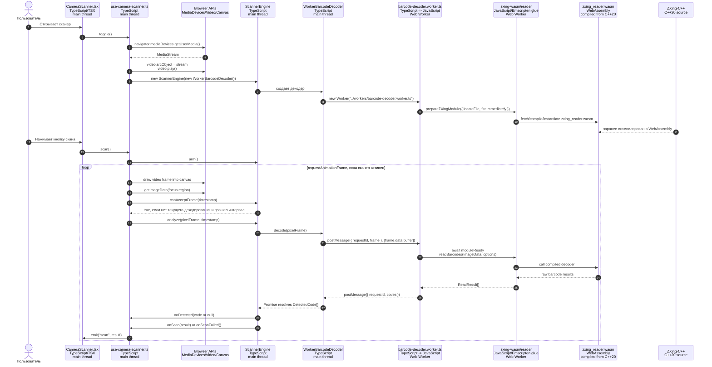
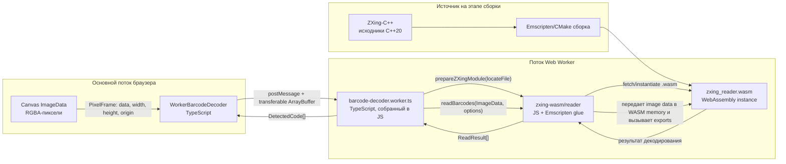

# Архитектура сканера

Этот документ описывает полный путь кадра: от камеры и UI до WebAssembly-декодера ZXing-C++ и результата сканирования.

## Языки и рантаймы

| Слой | Файл / пакет | Написано на | Где выполняется | Ответственность |
| --- | --- | --- | --- | --- |
| Оболочка приложения | `app/app.tsx` | TypeScript + TSX | Основной поток браузера, Nuxt/Vue | Хранит историю сканов и рендерит страницу. |
| UI сканера | `app/components/CameraScanner.tsx` | TypeScript + TSX | Основной поток браузера, Vue component | Рендерит панель камеры, кнопки, overlay и отправляет событие `scan`. |
| Жизненный цикл камеры | `app/composables/use-camera-scanner.ts` | TypeScript | Основной поток браузера | Открывает камеру, рисует видео в `canvas`, достает пиксели, управляет состоянием сканера. |
| Движок сканирования | `app/scanner/core/scanner-engine.ts` | TypeScript | Основной поток браузера | Ограничивает частоту анализа, не допускает параллельные декодирования, управляет попытками скана. |
| Адаптер worker-а | `app/scanner/infrastructure/worker-decoder.ts` | TypeScript | Основной поток браузера | Создает worker, отправляет буферы пикселей, резолвит `Promise` декодирования. |
| Worker декодера | `app/scanner/workers/barcode-decoder.worker.ts` | TypeScript, собирается в JavaScript | Поток Browser Web Worker | Загружает ZXing WASM, получает кадры, вызывает `readBarcodes`, возвращает коды. |
| JS/WASM-обвязка | `zxing-wasm/reader` | JavaScript + TypeScript types, Emscripten glue | Поток Browser Web Worker | Связывает JavaScript-данные с WASM-модулем. |
| WASM-бинарь | `zxing-wasm/reader/zxing_reader.wasm` | WebAssembly binary, собранный из C++ | WebAssembly engine браузера внутри worker-а | Выполняет скомпилированный код декодирования баркодов. |
| Исходный движок баркодов | upstream `zxing-cpp` | C++20 | Заранее компилируется в WASM | Реализует алгоритмы распознавания баркодов и QR-кодов. |

## Полный поток вызовов

## Worker и WASM подробнее

## Цепочка вызовов в коде

| Шаг | Кто вызывает | Что вызывает | Заметки |
| --- | --- | --- | --- |
| 1 | `CameraScanner.tsx` | `useCameraScanner(...).toggle()` | Пользователь открывает или закрывает панель сканера. |
| 2 | `use-camera-scanner.ts` | `navigator.mediaDevices.getUserMedia()` | Браузер возвращает camera `MediaStream`. |
| 3 | `use-camera-scanner.ts` | `new ScannerEngine(new WorkerBarcodeDecoder(), callbacks)` | Создается движок сканирования и декодер на worker-е. |
| 4 | `WorkerBarcodeDecoder` | `new Worker(new URL("../workers/barcode-decoder.worker.ts", import.meta.url))` | Запускается отдельный browser worker. |
| 5 | `barcode-decoder.worker.ts` | `prepareZXingModule(...)` | Загружается и инстанцируется `zxing_reader.wasm` внутри worker-а. |
| 6 | `use-camera-scanner.ts` | `requestAnimationFrame(renderFrame)` | Камерные кадры непрерывно рисуются в canvas. |
| 7 | `use-camera-scanner.ts` | `context.getImageData(...)` | Извлекается только фокусная область сканера как RGBA-пиксели. |
| 8 | `use-camera-scanner.ts` | `ScannerEngine.analyze(frame, timestamp)` | Pixel frame передается в движок, если тот готов принять работу. |
| 9 | `ScannerEngine` | `decoder.decode(frame)` | Декодирование делегируется адаптеру worker-а. |
| 10 | `WorkerBarcodeDecoder` | `worker.postMessage(..., [frame.data.buffer])` | Pixel buffer передается в worker без копирования. |
| 11 | `barcode-decoder.worker.ts` | `readBarcodes(request.frame as ImageData, options)` | Вызывается JS-обвязка, которая вызывает WASM instance. |
| 12 | `zxing_reader.wasm` | скомпилированный код ZXing-C++ | Выполняет CPU-heavy распознавание баркодов. |
| 13 | `barcode-decoder.worker.ts` | `self.postMessage(response)` | Валидные decoded codes отправляются обратно в основной поток. |
| 14 | `WorkerBarcodeDecoder` | `translateCodePosition(...)` | Координаты кода переводятся из координат focus-region в координаты полного кадра. |
| 15 | `ScannerEngine` | `callbacks.onDetected`, `callbacks.onScan`, `callbacks.onScanFailed` | Обновляет overlay и отправляет финальный результат или failure. |

## Важные границы

- Камера, video, canvas, UI, state и audio feedback работают в основном потоке браузера.
- Декодирование баркодов работает в Web Worker, чтобы тяжелое WASM-исполнение не блокировало UI rendering.
- WebAssembly инстанцируется внутри worker-а, а не в отдельном процессе.
- WASM-файл является binary artifact; исходный decoding engine написан на C++20 в ZXing-C++.
- Пакет `zxing-wasm` дает JavaScript/Emscripten-обвязку, через которую TypeScript-код вызывает скомпилированный C++ decoder.
