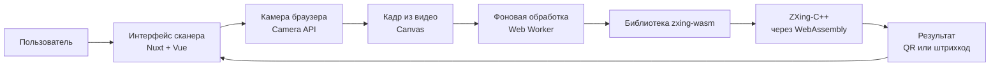
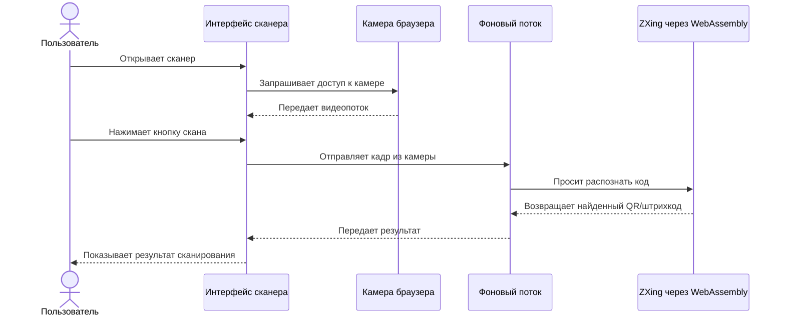
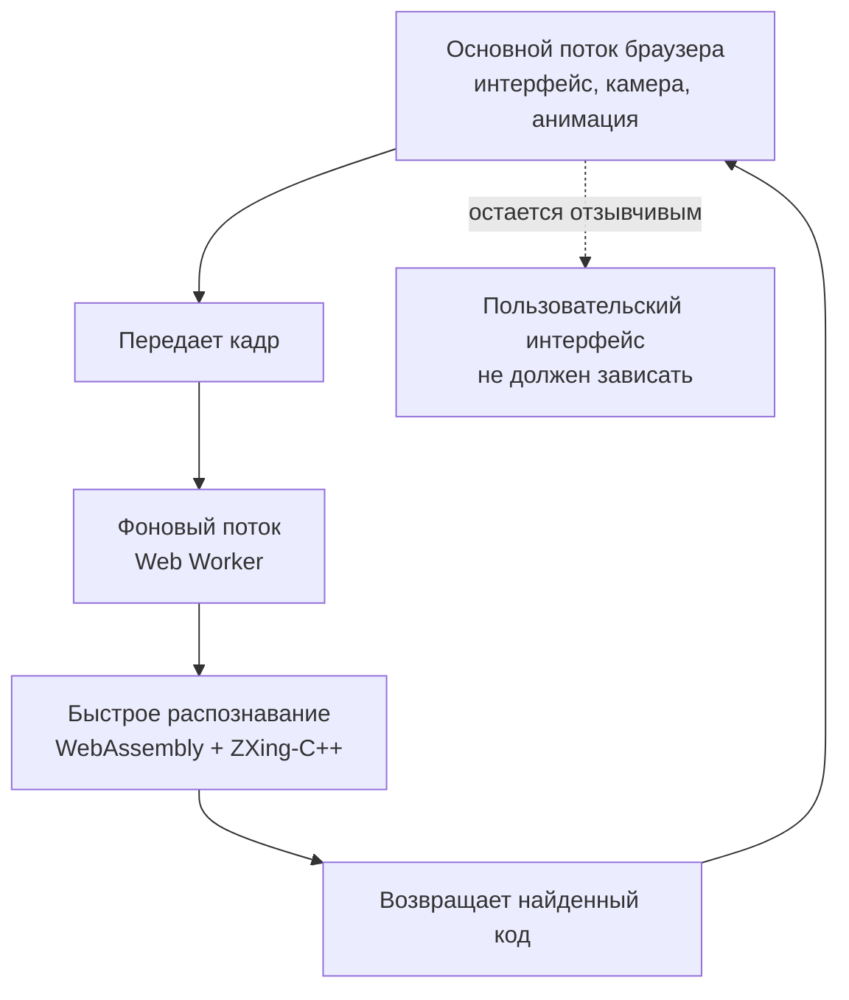

# Сканер: краткий обзор для менеджеров

Этот документ объясняет, из каких технологий состоит сканер и как данные проходят через систему без глубоких технических деталей.

## Что используется

| Технология / библиотека | Зачем нужна |
| --- | --- |
| Nuxt + Vue | Основа веб-приложения и интерфейса сканера. |
| TypeScript | Основной язык кода приложения. |
| Browser Camera API | Дает доступ к камере телефона или компьютера. |
| Canvas | Позволяет брать отдельные кадры из видеопотока камеры. |
| Web Worker | Выносит тяжелое распознавание в фоновый поток, чтобы интерфейс не зависал. |
| WebAssembly | Позволяет запускать быстрый скомпилированный код прямо в браузере. |
| `zxing-wasm` | NPM-библиотека, которая подключает ZXing к браузеру через WebAssembly. |
| ZXing-C++ | C++-движок, который реально распознает QR-коды и штрихкоды. |

## Общая схема

## Что происходит при сканировании

## Почему так сделано

## Ключевая мысль

Сканер является веб-компонентом на Nuxt/Vue и TypeScript. Камера и интерфейс работают в браузере, а распознавание QR-кодов и штрихкодов выполняет проверенный C++-движок ZXing, собранный в WebAssembly и запущенный в фоновом потоке браузера.
